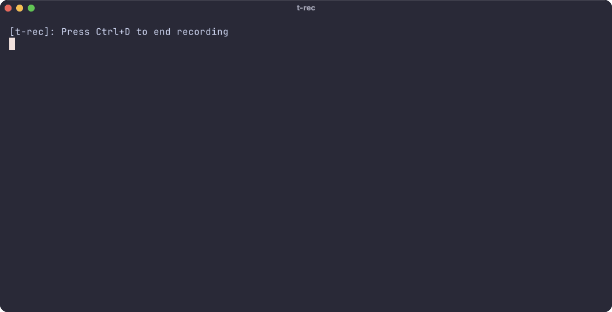

<div align="center">

# dab - Droid Automation Box 📦🤖

<p>
  <a href="https://crates.io/crates/dab-cli"></a>
  <a href="https://crates.io/crates/dab-cli"></a>
  <a href="https://crates.io/crates/dab-cli"></a>
</p>

<p>
A fast, interactive command-line tool for automating and managing your Android device from your computer.
</p>

</div>


## AI Agent Support

`dab` is designed to work seamlessly with AI agents (Claude, Cursor, Codex, etc.) through structured JSON output and non-interactive flags.

```bash
# Let the agent discover devices
dab devices --json

# Run any command non-interactively
dab health  --device emulator-5554 --json
dab apps    --device emulator-5554 --json
dab open    --device emulator-5554 --package com.example.app --json
dab install build/app.apk --device emulator-5554 --json
```

| Flag | Description |
|------|-------------|
| `--json` | Emit structured JSON instead of colored text |
| `--device <SERIAL>` | Target a specific device, no prompt |
| `--package <NAME>` | Target a specific app, no prompt |
| `--permissions <LIST>` | Comma-separated permissions for `grant`/`revoke` |

See [`SKILL.md`](SKILL.md) for the full agent guide with JSON examples for every command.

### Install the skill

Copy `SKILL.md` into your AI agent's skills directory so it automatically knows how to use `dab`:

```bash
bash scripts/install-skill.sh          # auto-detects ~/.cursor/skills, ~/.claude/skills, etc.
bash scripts/install-skill.sh --dest ~/.cursor/skills   # custom location
bash scripts/install-skill.sh --dry-run                 # preview without changes
```

---

## Features

- 🚀 **Open** installed apps
- 🗑️ **Uninstall** apps you don't need
- 🧹 **Clear** app data and cache
- 💀 **Force kill** stubborn apps
- 📦 **Download APK** files
- 📲 **Install APK/XAPK/APKM** files from your computer
- 🔍 **Show app info** (version, use `--all` for permissions)
- 📄 **Analyze local APK/XAPK/APKM** files without installation
- 🛡️ **Grant or revoke app permissions** (multi-select from known permissions)
- 🤖 **Show device info** (model, Android version, etc)
- 🌐 **Show network info** (IP, WiFi, etc)
- 🩺 **Device Health Check** (battery, storage, RAM, network)
- 📶 **Enable ADB over Wi-Fi** (connect wirelessly to your device)
- 🔌 **Switch ADB back to USB mode** (revert to cable connection)
- 📸 **Take screenshots**
- 🎥 **Record screen**
- 🔎 **Searchable app selection** (find your app in a snap)
- 🚀 **Launch** URLs or deep links in your Android device (open YouTube, browser, or any app via deep link)

## Usage

Run the interactive UI:

```bash
dab
```

Or use direct commands:

```bash
# 📱 List connected devices
dab devices

# 📦 List installed apps
dab apps

# 🚀 Open an app
dab open
dab open --package com.example.app --device emulator-5554

# 🗑️ Uninstall an app
dab uninstall
dab uninstall --package com.example.app --device emulator-5554

# 🧹 Clear app data
dab clear
dab clear --package com.example.app --device emulator-5554

# 💀 Force kill an app
dab force-kill
dab force-kill --package com.example.app --device emulator-5554

# 📦 Download APK (optionally specify output path)
dab download
dab download --output /path/to/save.apk

# 📲 Install APK, XAPK, or APKM file
dab install /path/to/app.apk
dab install /path/to/app.xapk
dab install /path/to/app.apkm

# 📄 Analyze local APK, XAPK, or APKM file (no device needed)
dab info /path/to/app.apk
dab info /path/to/app.xapk
dab info /path/to/app.apkm

# 🔍 Show app info
dab app-info
dab app-info --all   # include permissions (-a)

# 🛡️ Grant permissions to an app (multi-select, or pass --permissions for agents)
dab grant
dab grant --package com.example.app --permissions "android.permission.CAMERA,android.permission.RECORD_AUDIO"

# 🛡️ Revoke permissions from an app (multi-select, or pass --permissions for agents)
dab revoke
dab revoke --package com.example.app --permissions "android.permission.CAMERA"

# 🤖 Show device info
dab device

# 🌐 Show network info
dab network

# 📸 Take a screenshot
dab screenshot --output /path/to/screen.png

# 🎥 Record the screen
dab record --output /path/to/demo.mp4

# 📶 Enable ADB over Wi-Fi (no more cables!)
dab wifi

# 🔌 Switch ADB back to USB mode
dab usb

# 🩺 Device Health Check (battery, storage, RAM, network)
dab health

# 🚀 Launch a URL or deep link
dab launch <URL>
```

Example:

```sh
$ dab launch https://cesarferreira.com                     # URL that opens in your default browser
$ dab launch recipes://recipe/12345                        # DEEP LINK to the "recipes app"
$ dab launch https://www.youtube.com/watch?v=dQw4w9WgXcQ   # opens youtube
$ dab launch wathever you want                             # urls that deep link, apps, wathever
```

## Requirements

- [Rust](https://www.rust-lang.org/tools/install) (1.70+ recommended)
- [ADB (Android Debug Bridge)](https://developer.android.com/tools/adb) in your PATH
- An Android device or emulator with USB debugging enabled

## Installation 🥓

### From crates.io
```bash
cargo install dab-cli
```

### From Source
```bash
# Clone the repository
git clone https://github.com/cesarferreira/dab.git
cd dab

# Build and install
cargo install --path .
```

## License

MIT
